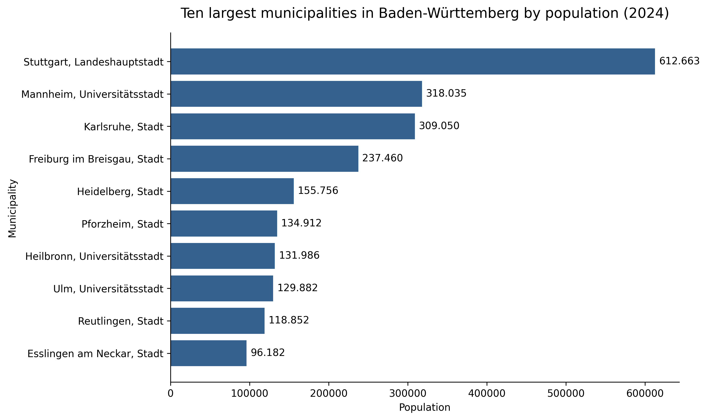
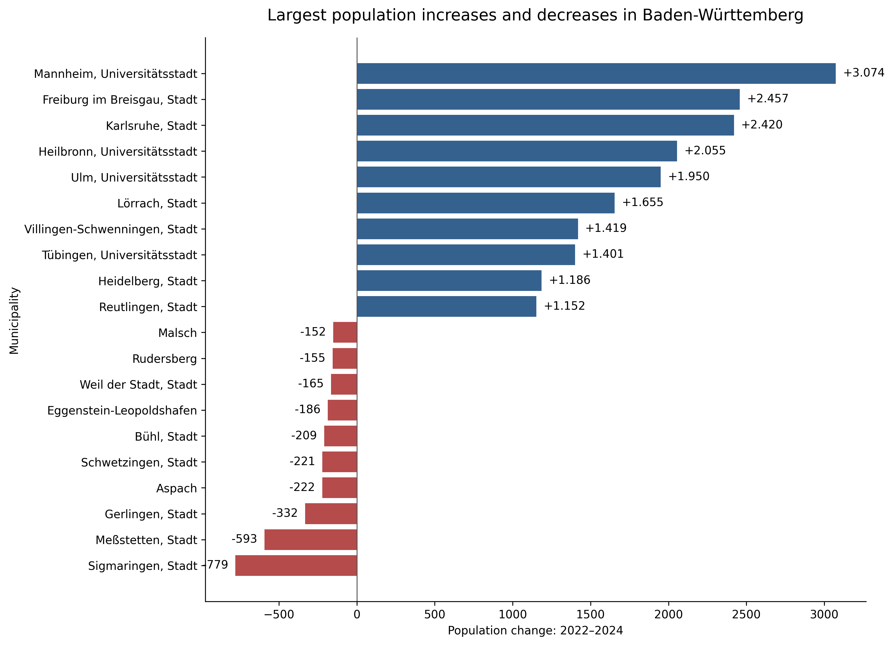
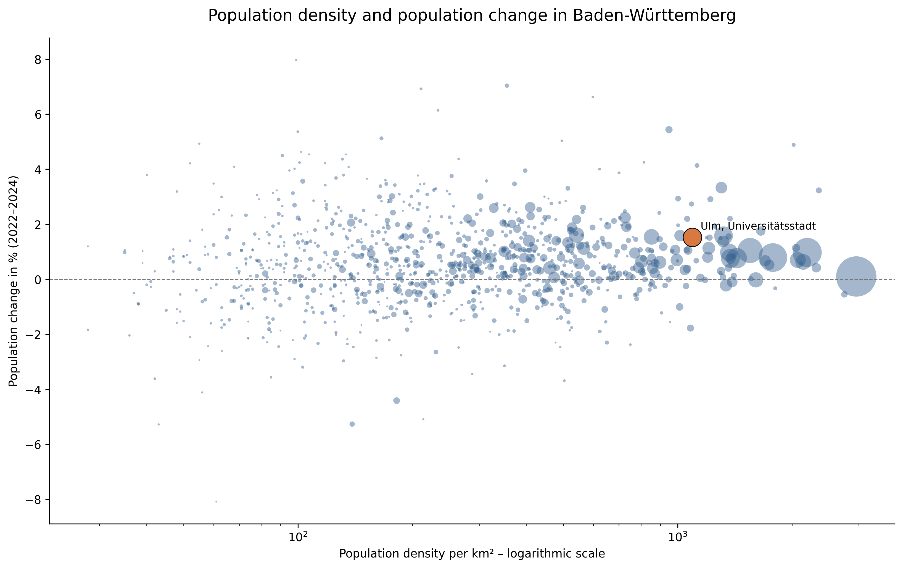

# Municipal Data Analysis – Baden-Württemberg

Exploratory analysis of population development across 1,101 municipalities in Baden-Württemberg between 2022 and 2024.

The project demonstrates a complete data-analysis workflow using Python, pandas, data visualization and SQL. It focuses on transforming official municipal data into clear insights that can support public-sector planning and decision-making.

## Key findings

- The population of Baden-Württemberg increased from **11,167,721 in 2022** to **11,245,898 in 2024**.
- This represents an increase of **78,177 residents**, or **0.70%**.
- **729 municipalities (66.2%)** recorded population growth.
- **368 municipalities (33.4%)** experienced population decline.
- Ulm grew from **127,932 to 129,882 residents**.
- Ulm’s increase of **1,950 residents or 1.52%** was more than twice the overall growth rate of Baden-Württemberg.

## Visualizations

### Largest municipalities by population



### Largest population increases and decreases



### Population density and population change

Ulm is highlighted to provide a local public-sector perspective.



## Tools and methods

- Python
- pandas
- NumPy
- Matplotlib
- SQL
- JupyterLab
- data cleaning and validation
- exploratory data analysis
- comparative municipal analysis
- data visualization

## Project structure

```text
german-municipal-data-analysis/
├── data/
│   ├── raw/
│   │   └── 11111-0001_flat.csv
│   └── processed/
│       └── municipal_population_analysis.csv
├── sql/
│   └── municipal_analysis.sql
├── visuals/
│   ├── top_10_municipalities_population_2024.png
│   ├── largest_population_changes_2022_2024.png
│   └── population_density_and_change.png
├── 01_municipal_data_analysis.ipynb
└── README.md